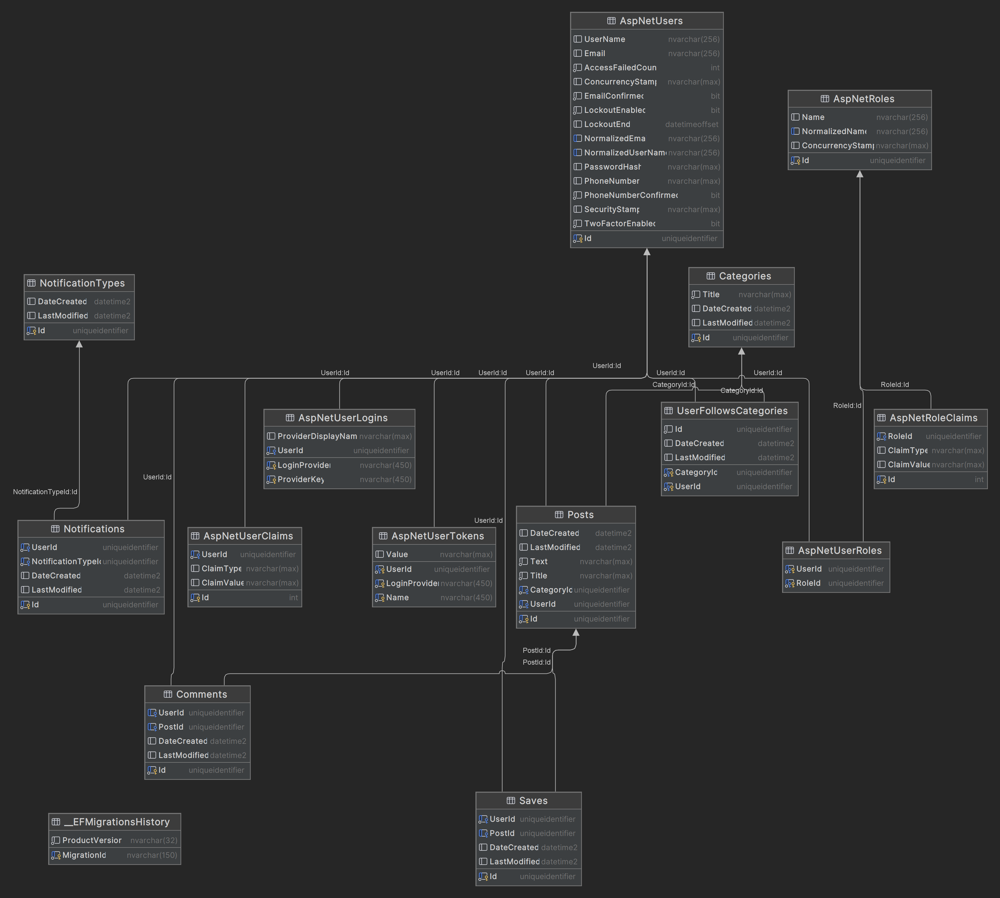

# Social-Sides

This repository contains the documentation and resources for the Social-Sides social media app.

## API Documentation

Visit the [API Documentation Website](https://social-sides.web.app/) for detailed information about the API used in this project.

## Database Diagram

> The image above illustrates the database structure used in this project.

## Tasks
  ### Backend (4 pt)
> Required
- [x] 3 Controllers (minimum) with CRUD
- [x] At least one relation of each type (1:1, 1:M, M:M), LINQ, JOIN, INLCUDE
- [x] Authentication + Roles (Admin, User, etc.)
- [x] Repository & Service pattern

> Extra
- [ ] Unit of work
- [ ] Specification Pattern
- [ ] Chat with SignalR
- [x] Identity Authentication
- [x] SMTP with Sengrid, SendinBlue, etc.
- [ ] Upload of files on S3 (AWS) / storage account (AZURE)
- [ ] Auth with refresh token
- [ ] Microservice architecture with mediator pattern
- [x] Firebase notifications
- [ ] Queues for messages

### Frontend (2 pt)
> Required
- [ ] At least 3 services connected to the API
- [ ] 1 directive (minimum)
- [ ] 1 pipe (minimum)
- [X] Register + Login (reactive forms) + Guard implementation

> Extra
- [ ] 3 rxjs methods that were not used during courses. [RXJS](https://rxjs.dev/api)
